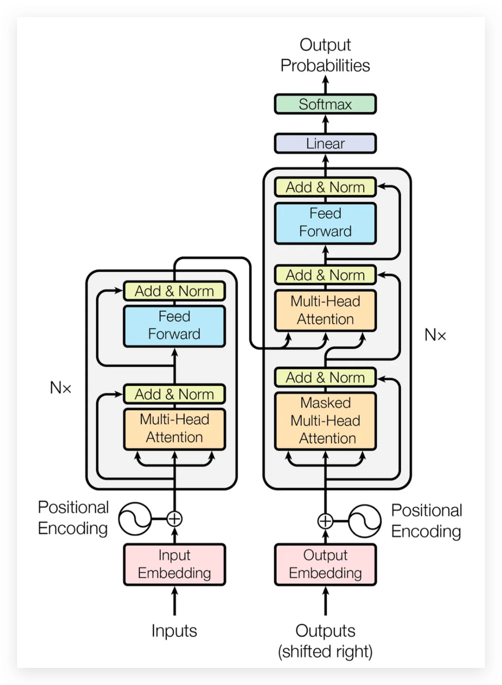
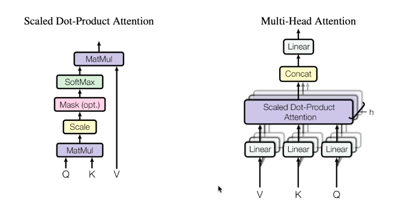

# MiniGPT-FromScratch

Implémentation pédagogique d'un mini-modèle de langage de type GPT en PyTorch, progressant du modèle bigram simple vers l'introduction des Transformers.

##  Objectif
Expliquer et implémenter pas à pas un mini-modèle de langage en utilisant le dataset **Tiny Shakespeare** (1 MB).

##  Référence
**Paper :** [Attention Is All You Need](https://arxiv.org/abs/1706.03762) (Vaswani et al., 2017)

Le TRANSFORMER fait tout le travail lourd sous le capot. Notre objectif : entraîner un modèle de langage basé sur cette architecture.

---

##  Progression du projet

Ce projet suit une approche pédagogique progressive :

1. **Démarrage simple** : modèle Bigram (baseline) qui prédit le caractère suivant basé uniquement sur le caractère actuel
2. **Introduction de l'attention** : mécanismes Self-Attention pour capturer le contexte
3. **Construction du Transformer** : architecture complète avec Multi-Head Attention, Feed-Forward Networks, et connexions résiduelles
4. **Entraînement** : sur le dataset Tiny Shakespeare avec optimiseur AdamW
5. **Génération de texte** : production de texte cohérent style Shakespeare

 **Pour l'implémentation complète étape par étape, consultez le notebook [`Mini_gpt.ipynb`](./Mini_gpt.ipynb)**

---
#  Hyperparamètres used for training

| Paramètre  | Signification |
|-----------|---------------|
| `batch_size`  | Nombre d'exemples traités en parallèle |
| `block_size` | Longueur du contexte (nombre de tokens pour prédire le suivant) |
| `max_iters` | Nombre d'itérations d'entraînement |
| `learning_rate` | Taux d'apprentissage pour l'optimiseur AdamW |
| `eval_interval` | Fréquence d'évaluation (tous les 300 steps) |
| `eval_iters` | Nombre de batches pour calculer la perte moyenne |
| `device` | GPU si disponible, sinon CPU |

## Reproductibilité
- `torch.manual_seed(1337)` : fixe la graine aléatoire pour des résultats reproductibles

#  Modèle Bigram (Point de départ)

## Principe
- Modèle **extrêmement simple** : prédit le prochain caractère basé **uniquement sur le caractère actuel**
- Pas d'attention, pas de mémoire du contexte
- Utilise `nn.Embedding(vocab_size, vocab_size)` : table de correspondance caractère → vecteur
## Génération de texte
1. Prend le dernier caractère
2. Prédit le prochain (via softmax + échantillonnage)
3. Ajoute le nouveau caractère
4. Répète
#  Fonction de perte : Cross-Entropy

- Mesure l'erreur entre les prédictions (logits) et les vraies réponses (targets)
- Formule : $\text{Loss} = -\sum_{i=1}^{C} y_i \log(\hat{y}_i)$
- Plus la perte est basse, meilleures sont les prédictions

#  Optimiseur : AdamW

- **AdamW** : version améliorée d'Adam avec weight decay décorrélé
- **Avantages** :
  - Meilleure généralisation
  - Standard pour les Transformers
  - Évite l'overfitting plus efficacement
---


# Comprendre les mécanismes d'attention

## Les vecteurs fondamentaux : X, Q, K, V

**X** contient l'identité et la position des tokens ; c'est l'information privée de chaque token.

Pour un token donné (ex : le cinquième), il possède son propre vecteur X.

**Q (Query)** représente ce que ce token cherche à écouter dans le passé.

**K (Key)** représente ce que chaque token du passé peut offrir comme information.

**V (Value)** est ce que chaque token communique réellement et sera agrégé.

L'attention combine les V des tokens passés pondérés par l'intérêt du token courant (calculé via Q et K).

**Résultat :** chaque token reçoit une représentation enrichie, dépendante des tokens passés pertinents.



---

# Principes généraux de l’attention
1.  Attention (Self-Attention)
- Chaque token est un nœud dans un graphe dirigé.
- Il regarde tous les autres nœuds et agrège l’information via une somme pondérée.
- Les poids sont calculés via des similarités entre requêtes (Q) et clés (K).
2.  Pas de notion d'espace intrinsèque:
- L'attention opère sur des ensembles de vecteurs sans structure spatiale implicite.
- **Encodage positionnel** nécessaire pour injecter l'information de position (voir section dédiée ci-dessous).
3. Batch indépendant:
- Chaque séquence dans un batch est traitée indépendamment.
- Les séquences dans le batch ne communiquent jamais entre elles.

# Types d'attention
### 1. Self-Attention
- Les clés K et valeurs V sont générées à partir du même input que les requêtes Q.
- **Exemple :** langage → le token regarde les tokens précédents de sa propre séquence.

### 2. Cross-Attention
- Les requêtes Q viennent d'un input x, mais K et V viennent d'une source externe.
- **Exemple :** Transformer encoder-decoder → décodeur regarde l'encodeur.

# Comparaison des mécanismes d’attention : Attention causale (GPT) vs bidirectionnelle (BERT) 
1.  Attention causale (masked attention)
- Utilisée dans les modèles autoregressifs (ex : GPT).
- Chaque token ne peut regarder que les tokens précédents.
- Empêche la fuite d’information future.
2.  Attention bidirectionnelle
- Utilisée dans les modèles comme BERT.
- Chaque token peut regarder tous les autres tokens dans la séquence.
- Permet une compréhension globale du contexte.


# Comparaison entre Attention et Convolution
### Convolution

- Travaille sur un layout spatial fixe (images, grilles, séries temporelles).

- Les filtres convolutifs glissent sur l’espace et capturent des motifs locaux.

- Les positions relatives sont intrinsèquement codées par la structure de la convolution.

- Pas besoin d'encoding positionnel : la position est implicite dans la manière dont les filtres parcourent les données.

---

# Notion d'encodage positionnel

## Pourquoi en a-t-on besoin ?
- L'attention (self-attention ou multi-head) **n'a pas de notion intrinsèque de position**.
- Sans encodage positionnel, le modèle ne peut pas distinguer l'ordre des tokens.
- Les phrases "le chat mange la souris" et "la souris mange le chat" seraient identiques pour le modèle !

## Solution
- Un **encodage positionnel** est ajouté aux embeddings des tokens.
- Cet encodage injecte l'information de position dans les représentations.

## Types d'encodage positionnel

### 1. Encodage sinusoïdal (Transformer original)
- Utilise des fonctions sinus et cosinus de différentes fréquences.
- Formule : 
  - $PE_{(pos, 2i)} = \sin(pos / 10000^{2i/d_{model}})$
  - $PE_{(pos, 2i+1)} = \cos(pos / 10000^{2i/d_{model}})$
- **Avantage :** peut généraliser à des séquences plus longues que celles vues à l'entraînement.

### 2. Encodage appris (GPT, BERT)
- Les positions sont représentées par des embeddings appris pendant l'entraînement.
- Plus flexible mais limité à la longueur maximale vue pendant l'entraînement.

---

# Multi-Headed Self-Attention

## Motivation
- Dans self-attention, chaque token regarde les autres tokens et agrège l'information via Q, K, V.
- **Problème :** un seul head peut capturer une seule « perspective » des relations entre tokens.
- **Solution :** Multi-Head Attention → plusieurs « heads » indépendants en parallèle.

## Principe
- Plusieurs têtes d'attention parallèles permettent au modèle de capturer différents types de relations entre tokens.
- Chaque tête a ses propres matrices de projection pour Q, K, et V.
- Les sorties des différentes têtes sont concaténées et projetées pour former la sortie finale.

## Intuition

Chaque head peut apprendre un type de relation différent :

- **Head 1 :** dépendances à courte distance
- **Head 2 :** dépendances syntaxiques
- **Head 3 :** dépendances sémantiques

En combinant les heads, chaque token obtient une représentation enrichie capturant plusieurs types d'information.

## Avantages du Multi-Head Attention

### 1. Capturer plusieurs types de dépendances
- Chaque head se spécialise dans un aspect différent des relations entre tokens.
- Permet au modèle d'analyser simultanément différentes perspectives du contexte.

### 2. Stabiliser l'apprentissage
- Diviser la dimension totale en sous-espaces.
- Chaque head a une dimension réduite : $d_{\text{head}} = C/h$, ce qui rend le calcul plus stable.
- Réduit le risque de sur-apprentissage sur une seule représentation.

### 3. Augmenter la capacité sans trop gonfler le modèle
- Au lieu d'augmenter la dimension d'un seul head, on parallélise plusieurs petits heads.
- Coût computationnel similaire mais représentation plus riche.
- Permet d'avoir plus de paramètres sans explosion de la complexité.
# Mécanisme de l'attention pas à pas

1. Projection linéaire par head
    - Chaque token d'entrée est projeté en trois vecteurs distincts : Q, K, et V via des matrices de poids apprises.

2. Calcul des scores d'attention par head
    - Les scores d'attention sont calculés en effectuant le produit scalaire entre Q et K.
    - Ces scores sont ensuite normalisés (souvent via softmax) pour obtenir des poids d'attention.

3. Agrégation pondérée
    - Les poids d'attention sont utilisés pour faire une moyenne pondérée des vecteurs V, produisant ainsi la sortie finale pour chaque token.

4. Concaténation des heads
    - Les sorties de tous les heads sont concaténées.
    - Une projection linéaire finale transforme la concaténation en représentation de sortie.



---

# Feed-Forward Network (FFN)

# Position dans l'architecture
- Le **FFN** est appliqué juste après la **Multi-Head Attention (MHA)**, généralement après une connexion résiduelle et une LayerNorm.
- Schéma d'un bloc Transformer :
  1. Multi-Head Attention
  2. Add & Norm (résiduel + normalisation)
  3. **Feed-Forward Network** (FFN)
  4. Add & Norm (résiduel + normalisation)

# Rôle du FFN
- Après la MHA, chaque token a déjà agrégé l'information des autres tokens.
- Le FFN **transforme chaque token individuellement** pour enrichir sa représentation.
- Il ne mélange pas les tokens entre eux : traitement **token-wise** (position par position).

# Structure du FFN
- **Linear layer 1** : expansion de la dimension pour augmenter la capacité de représentation ($d_{\text{model}} \rightarrow d_{ff}$, typiquement $4\times$ plus grand).
- **Activation** : non-linéarité (ReLU ou GELU) pour capturer des relations complexes.
- **Linear layer 2** : projection de retour à la dimension originale $C = d_{\text{model}}$ afin de permettre la connexion résiduelle.

# Forme mathématique

```
FFN(x) = Activation(xW₁ + b₁)W₂ + b₂
```
```python

class FeedFoward(nn.Module):
    """ a simple linear layer followed by a non-linearity """

    def __init__(self, n_embd):
        super().__init__()
        self.net = nn.Sequential(
            nn.Linear(n_embd, 4 * n_embd),
            nn.ReLU(),
            nn.Linear(4 * n_embd, n_embd),
            nn.Dropout(dropout),
        )

    def forward(self, x):
        return self.net(x)
```

# Notes pratiques
- Le FFN est appliqué **indépendamment sur chaque position** (pas de mélange entre tokens à cette étape).
- L'expansion puis réduction de dimension ajoute de la capacité sans changer la taille finale, ce qui autorise la connexion résiduelle.

---

# Connexions résiduelles (Residual Connections)

## Principe
- On ajoute l'entrée d'une couche à sa sortie :

```
output = Layer(x) + x
```

- Souvent suivi d'une **LayerNorm** pour stabiliser l'entraînement :

```
output = LayerNorm(Layer(x) + x)
```

## Pourquoi c'est important ?

- **Évite le vanishing gradient** : les gradients circulent directement à travers le réseau profond.
- **Facilite l'apprentissage** : même si la couche apprend une quasi-identité, le modèle reste fonctionnel.
- **Stabilité** : avec des blocs d'attention et de FFN profonds, les résiduels empêchent la sortie de trop diverger de l'entrée.

## Où ça se place dans un bloc Transformer ?

Chaque sous-couche (MHA puis FFN) est enveloppée par une connexion résiduelle suivie d'une normalisation :

```
x -> Layer -> Add (avec x) -> LayerNorm
```

On applique ce schéma une fois autour du MHA, puis une fois autour du FFN.

---
# Layer Normalization (LayerNorm) dans les Transformers

## Qu’est-ce que LayerNorm ?

**LayerNorm** est une technique de normalisation appliquée **sur les features d’un token**.  
Contrairement à **BatchNorm** qui normalise sur le batch, LayerNorm normalise sur les dimensions **d’un token individuel**.

Formule :

$$
\text{LayerNorm}(x_t) = \gamma \odot \frac{x_t - \mu}{\sqrt{\sigma^2 + \epsilon}} + \beta
$$

avec :

- \(x_t \in \mathbb{R}^C\) : vecteur d’un token
- \(\mu = \frac{1}{C} \sum_{i=1}^C x_{t,i}\) : moyenne des features du token
- \(\sigma^2 = \frac{1}{C} \sum_{i=1}^C (x_{t,i}-\mu)^2\) : variance des features
- \(\gamma, \beta \in \mathbb{R}^C\) : paramètres appris (scale & shift)
- \(\epsilon\) : petite constante pour stabilité numérique

---

## Pourquoi LayerNorm ?

1. **Stabilise l’apprentissage**  
   Les sorties des blocs MHA ou FFN peuvent avoir des distributions variables. Normaliser chaque token permet aux gradients de rester stables.

2. **Indépendance au batch size**  
   Fonctionne même avec **batch size = 1**, contrairement à BatchNorm.

3. **Facilite la convergence**  
   Les modèles profonds comme GPT ou BERT apprennent plus rapidement et efficacement.

---

## Où l’utiliser dans un Transformer ?

- Après chaque bloc avec **residual connection** :

\[
x \leftarrow \text{LayerNorm}(x + \text{MHA}(x))
\]

\[
x \leftarrow \text{LayerNorm}(x + \text{FFN}(x))
\]

- Schéma simplifié :


---
##  Architecture complète d'un bloc Transformer

```
Input
  ↓
Multi-Head Attention
  ↓
Add & Norm (+ residual)
  ↓
Feed-Forward Network
  ↓
Add & Norm (+ residual)
  ↓
Output
```

Cette structure se répète N fois (ex : 12 couches pour GPT-2, 96 pour GPT-3).

